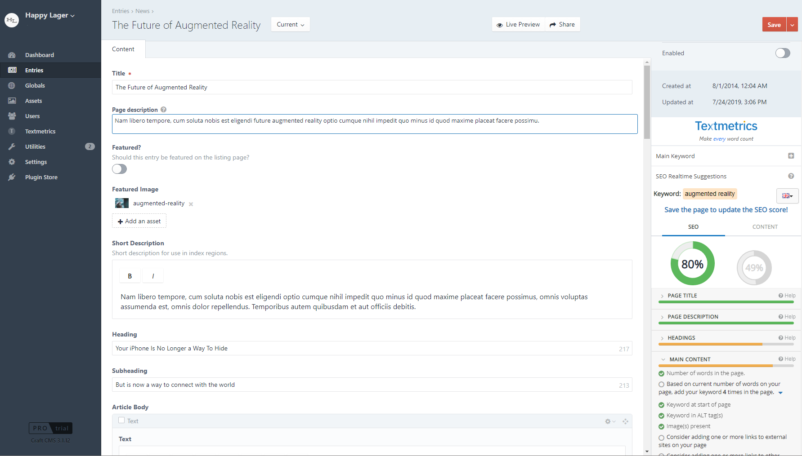

# Textmetrics (formerly webtexttool) for Craft CMS 3.x
Textmetrics is the easiest way to make your website content SEO proof, resulting in higher search engine rankings and more traffic to your website. With Textmetrics everyone can create high quality content that matches your target audience and at the same time make sure it's SEO proof. 

What you can do with the Textmetrics plugin: 

### Content Quality and SEO optimization suggestions
The Textmetrics plugin integrates with the Craft CMS editor. While writing your content, you can get suggestions on how to improve your content. The suggestions will show directly alongside the editor, so they are clearly visible and easy to follow.

### Analysis of your content
Textmetrics will analyze your content and tell you how to optimize it for maximum results in search engine rankings. 

### Keyword analysis & research
Textmetrics will help you find the best keywords for your content. Fill in your keyword to have it analyzed on volume and competition in realtime and also get suggestions on other keywords you could use.

### Text Conversion Optimizer / Content Quality
This module analyses your content and gives you tips to increase the readability of your text and improve the chances of conversion. Check our [video](https://youtu.be/5NZ6IjHntIQ) to find out more about this module!

### Up-to-date SEO rules
We make sure that the Textmetrics engine is always up-to-date with the latest SEO rules. So you will always have access to the latest SEO rules and insights to optimize your content

Textmetrics can be used alongside other popular SEO plugins.

## Requirements

This plugin requires Craft CMS 3.0.0 or later.

## Installation & Usage

To install the plugin, follow these instructions.

1. Open your terminal and go to your Craft project:

        cd /path/to/project

2. Then tell Composer to load the plugin:

        composer require inalgiev/craft-webtexttool

3. In the Control Panel, go to Settings → Plugins and click the “Install” button for **Textmetrics**.

4. Click on **Textmetrics** on the side panel and login using your Textmetrics credentials. If you don't have an account, you can create one for free [here](https://app.textmetrics.com/#/register-free). You can also use the API key. Overwrite the config file `wttApiKey` variable to add the API key.

## FAQ

### Is Textmetrics for Craft CMS free?
Yes, it’s free. The plugin is free. To use it you will need a free Textmetrics account. With a free account you will have access to realtime SEO suggestions and Keyword analysis & research. You will have at least 10 keyword analysis credits per month. If you would need more than that, you could consider upgrading your Textmetrics account.

### Do you have a Pro / paid version?
Yes, we have. Read more on our [website](https://www.textmetrics.com/pricing). The main difference with the free Textmetrics account, is that you will get more keyword analysis credits.

### Do you offer support?
Yes, of course! If you have any questions, please don’t hesitate to [contact us](https://www.textmetrics.com/contact). We love to hear from you and will try to solve any issues asap.

---
*This is the Craft 3.x version, for the Craft 2.x version see [link](https://github.com/iNalgiev/webtexttool)*.